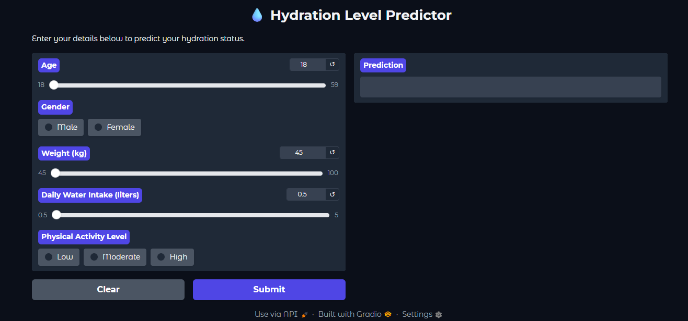

# 💧 Hydration Level Prediction Using Machine Learning

A Machine Learning project that predicts hydration status using health and lifestyle parameters. The project compares multiple classification algorithms and deploys the best-performing model using Gradio.

---

## 📌 Project Overview

Hydration plays an important role in overall health and physical performance. This project uses Machine Learning techniques to classify individuals as:

- Hydrated
- At Risk of Dehydration

The project evaluates multiple classification models and selects the best-performing algorithm based on accuracy.

---

## 🚀 Features

- Data Cleaning & Preprocessing
- Exploratory Data Analysis (EDA)
- SMOTE for class balancing
- Multiple ML model comparison
- Model evaluation using accuracy & confusion matrix
- Gradio web interface deployment

---

## 📊 Dataset Information

- Dataset Size: **21,450 records**
- Features:
  - Age
  - Gender
  - Weight (kg)
  - Daily Water Intake (liters)
  - Physical Activity Level
- Target Variable:
  - Hydrated
  - At Risk of Dehydration

---

## 🛠️ Technologies Used

- Python
- Pandas
- NumPy
- Matplotlib
- Seaborn
- Scikit-learn
- XGBoost
- Imbalanced-learn (SMOTE)
- Gradio

---

## 🤖 Machine Learning Models

- Logistic Regression
- Random Forest
- XGBoost
- Gradient Boosting

---

## 🏆 Best Model

### Random Forest Classifier
- Accuracy: **78.84%**
- Selected as final deployed model

---

## 📈 Project Workflow

1. Data Collection
2. Data Cleaning
3. Exploratory Data Analysis
4. Feature Encoding
5. Feature Scaling
6. SMOTE Balancing
7. Model Training
8. Model Evaluation
9. Deployment using Gradio

---

## 📷 Project Screenshots

### Exploratory Data Analysis

### Model Performance Comparison

### Gradio User Interface

---

